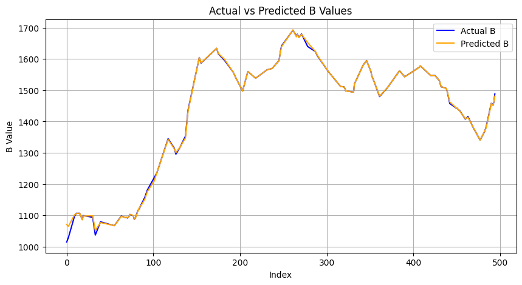

# FuzzyPredictionStock

Predict stock prices using fuzzy logic and machine learning techniques.

## Description

This project uses historical data from the Tehran Stock Exchange and applies fuzzy logic to predict stock prices. A RandomForestRegressor is trained using the fuzzy features generated from stock prices.

## Installation

To get started with this project, ensure you have the required libraries:

```bash
pip install -r requirements.txt
```

#### Requirements:

- `pandas`
- `numpy`
- `scikit-learn`
- `matplotlib`
- `seaborn`

## Usage

1. **Prepare the Dataset:**
   - Download the [Tehran Stock Exchange Dataset](https://drive.google.com/uc?id=196FqeYd39uvgEsNEyzBZ73_b7bi6Blkl) and place it in the same directory as the code.

2. **Run the Code:**
   - Ensure the dataset is available in the same directory as `FuzzyPredictionStock.ipynb`.
   - Execute the notebook or the provided Python script.

## Results

The predicted stock prices versus actual prices can be visualized using the provided plot function.

### Visualization Example:


