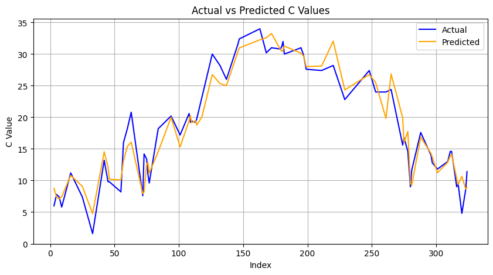

# FuzzyPredictionTemperature

Predict temperatures using fuzzy logic and polynomial regression techniques.

## Description

This project uses historical temperature data and applies fuzzy logic to predict future temperatures. Polynomial regression is used to generate predictive models based on fuzzy features.

## Installation

To get started with this project, ensure you have the required libraries:

```bash
pip install -r requirements.txt
```

#### Requirements:

- `pandas`
- `gdown`
- `scikit-learn`
- `matplotlib`
- `seaborn`

## Usage

1. **Prepare the Dataset:**
   - Download the [Temperature Dataset](https://drive.google.com/uc?id=1kEOahkOFqGJHdwpp9TxZ8sSB9MmVun5d) and place it in the same directory as the code.

2. **Run the Code:**
   - Ensure the dataset is available in the same directory as `FuzzyPredictionTemperature.ipynb`.
   - Execute the notebook or the provided Python script.

## Results

The predicted temperatures versus actual temperatures can be visualized using the provided plot function.

### Visualization Example:


